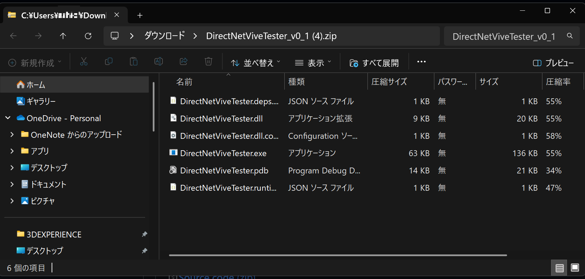
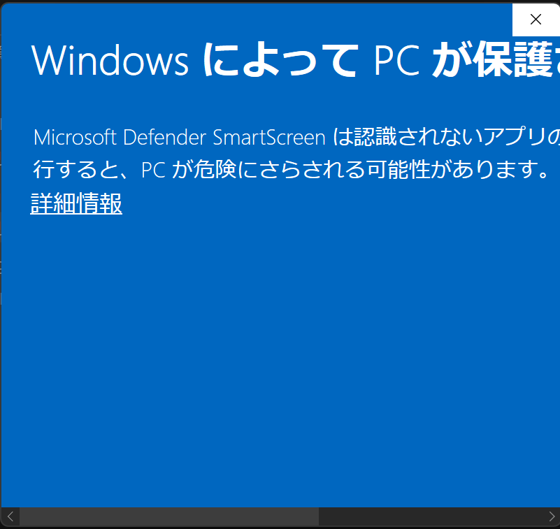
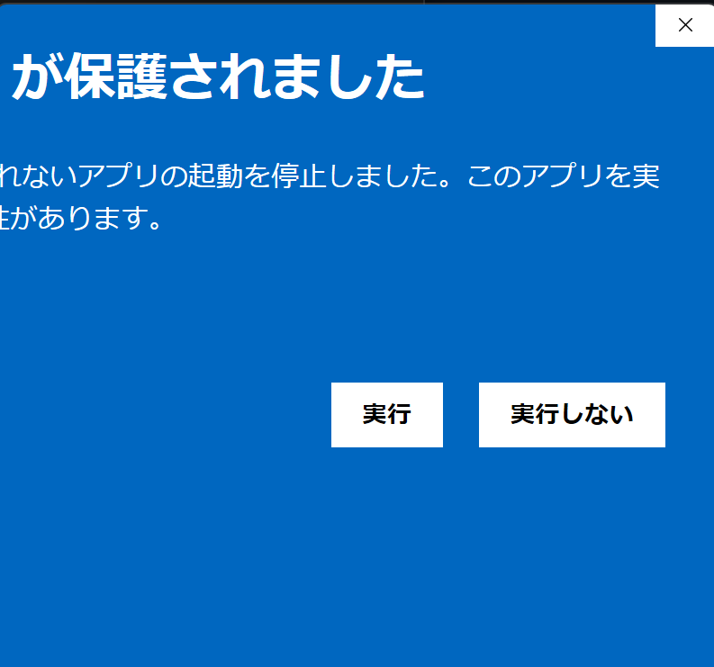
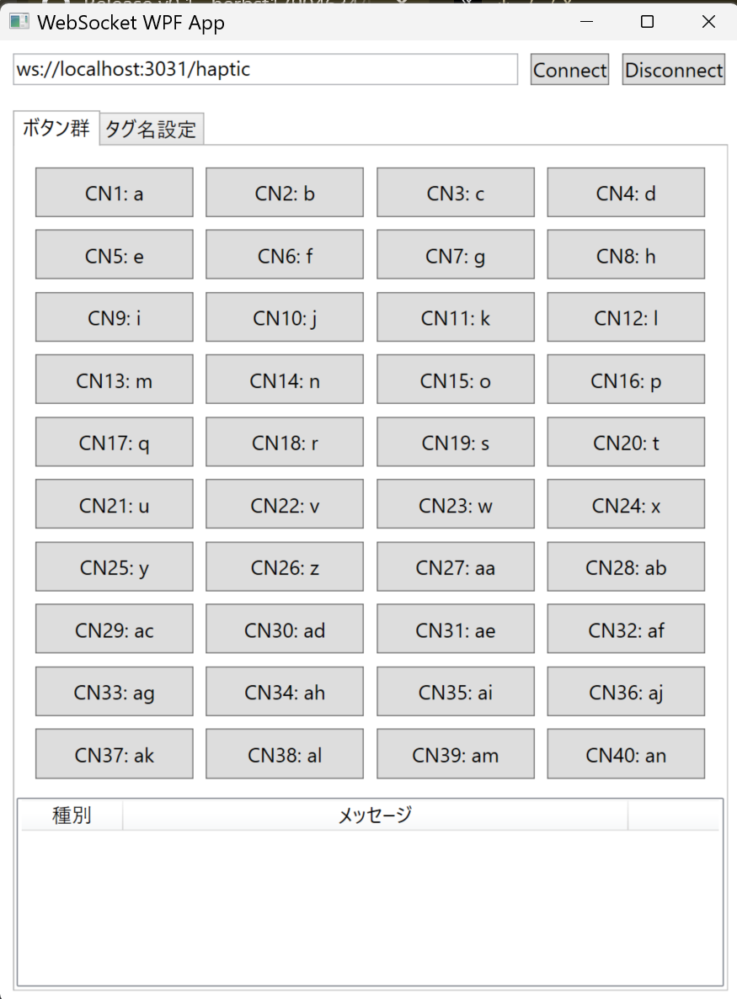

# DirectNetViveTester

buttplug-liteベースのハプティックフィードバックシステムをテストするためのWPFアプリケーションです。buttplug-liteサーバーに接続し、カスタマイズ可能な値でタグ付きメッセージを送信する直感的なインターフェースを提供します。

## 機能

- **buttplug-liteクライアント**: 任意のbuttplug-lite WebSocketサーバーに接続
- **40個の設定可能ボタン**: カスタム値でタグ付きメッセージを送信
- **タグ管理**: 各チャンネルのタグ名と送信値を設定
- **接続状態監視**: ping ベースの自動接続確認
- **設定の永続化**: WebSocket URLを自動保存・復元
- **リアルタイムログ**: 接続状況とメッセージ送信ログを表示

## 必要要件

- .NET 8.0 以降
- Windows オペレーティングシステム
- Visual Studio 2017 以降（開発用）

## はじめに

### インストール

1. リポジトリをクローンします
2. Visual Studio で `DirectNetViveTester.sln` を開きます
3. アプリケーションを実行します

### クイックスタート

1. **buttplug-liteサーバーに接続**:
   - buttplug-lite URL を入力（デフォルト: `ws://localhost:3031/haptic`）
   - "Connect" ボタンをクリック

2. **メッセージ送信**:
   - 40個の事前設定ボタンを使用してタグ付きメッセージを送信
   - 各ボタンは `{タグ名}:{送信値}` 形式でメッセージを送信

3. **タグのカスタマイズ**:
   - "タグ名設定" タブに切り替え
   - 必要に応じてタグ名と送信値を変更
   - "反映" ボタンをクリックして変更を適用

## 使用方法

実行ファイルを起動すると、Microsoft Defender SmartScreenの警告が表示されます。プログラムの実行を続けるには使用者が実行の許可を与える必要があります。

1. [Release](https://github.com/ashio-t/DirectNetVibeTester/releases)ページから最新のリリースのZIPファイルをダウンロードします。
1. ダウンロードしたZIPファイルを展開します。
<p align="center">

</p>
1. `DirectNetViveTester.exe`をダブルクリックして実行します。
1. "Windows Defender SmartScreen……"の警告が表示されるので、`詳細情報`をクリックします。
<p align="center">

</p>
1. "Windows Defender SmartScreen……"ウィンドウを横にスクロールして右側の`実行`ボタンを見つけ、クリックし、実行に許可を与えてください。
<p align="center">

</p>
1. デフォルトで表示されているURLを参考に、接続したいbuttplug-liteサーバーのURLを入力し、`Connect`ボタンをクリックしてください。接続成功のメッセージが表示されたら、正常に接続されています。`CN1:a`から始まるボタンを押すと、それぞれのタグ名と送信値でメッセージが送信されます。
<p align="center">

</p>

### デフォルト設定

アプリケーションには40個の事前定義タグが含まれています：
- タグ: `a` から `z`、その後 `aa` から `an`
- デフォルト送信値: すべてのタグで `1.0`

### メッセージ形式

メッセージは以下の形式で送信されます：
```
{タグ名}:{送信値}
```

例: `a:1.0`, `haptic_left:0.5`

### 接続管理

- **Connect**: WebSocket接続を確立
- **Disconnect**: 接続を正常に終了
- **自動再接続**: 接続切断を自動処理

## 開発

### プロジェクト構造

```
DirectNetViveTester/
├── MainWindow.xaml          # メインUI レイアウト
├── MainWindow.xaml.cs       # メインアプリケーションロジック
├── App.xaml                 # アプリケーションリソース
├── App.xaml.cs              # アプリケーションエントリーポイント
├── Properties/
│   └── Settings.settings    # ユーザー設定
└── DirectNetViveTester.csproj
```

## 設定

### 設定項目

ユーザー設定は `Properties/Settings.settings` に自動保存されます：
- 最後に使用したbuttplug-lite URL
- ウィンドウの位置とサイズ

### カスタマイズ

- **タグ名**: 40個の各チャンネルにカスタム名を設定
- **送信値**: 各タグにカスタム数値を設定
- **buttplug-lite URL**: 必要に応じて異なるサーバーに接続

## トラブルシューティング

### よくある問題

1. **接続失敗**: buttplug-liteサーバーが実行中でアクセス可能か確認
2. **メッセージが送信されない**: ログウィンドウで接続状態を確認
3. **設定が保存されない**: アプリケーションに書き込み権限があるか確認

### ログメッセージ

アプリケーションは以下のリアルタイムログを表示します：
- 接続状態
- メッセージ送信結果
- エラー詳細


## ライセンス

[MITライセンス](LICENSE)の下で提供されています。
このプロジェクトは使用・変更が可能です。

## 作者

[Herbst17904634](https://x.com/Herbst17904634)
